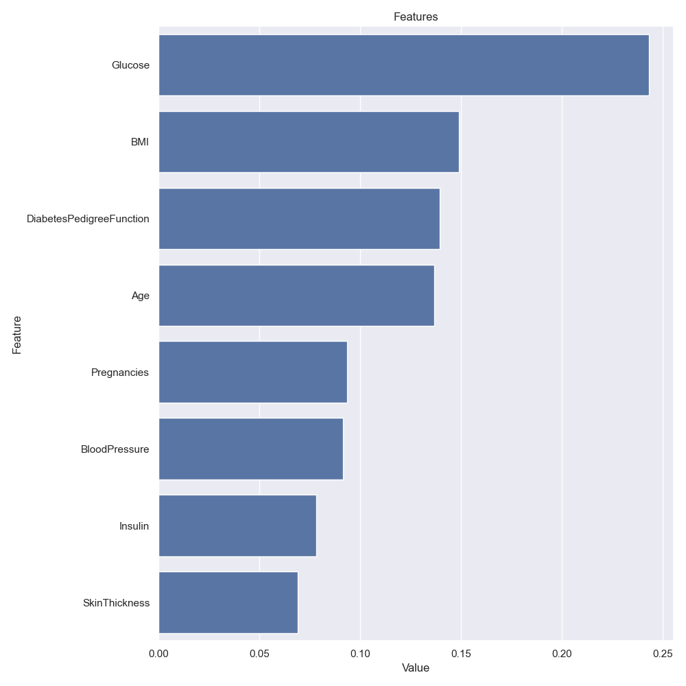
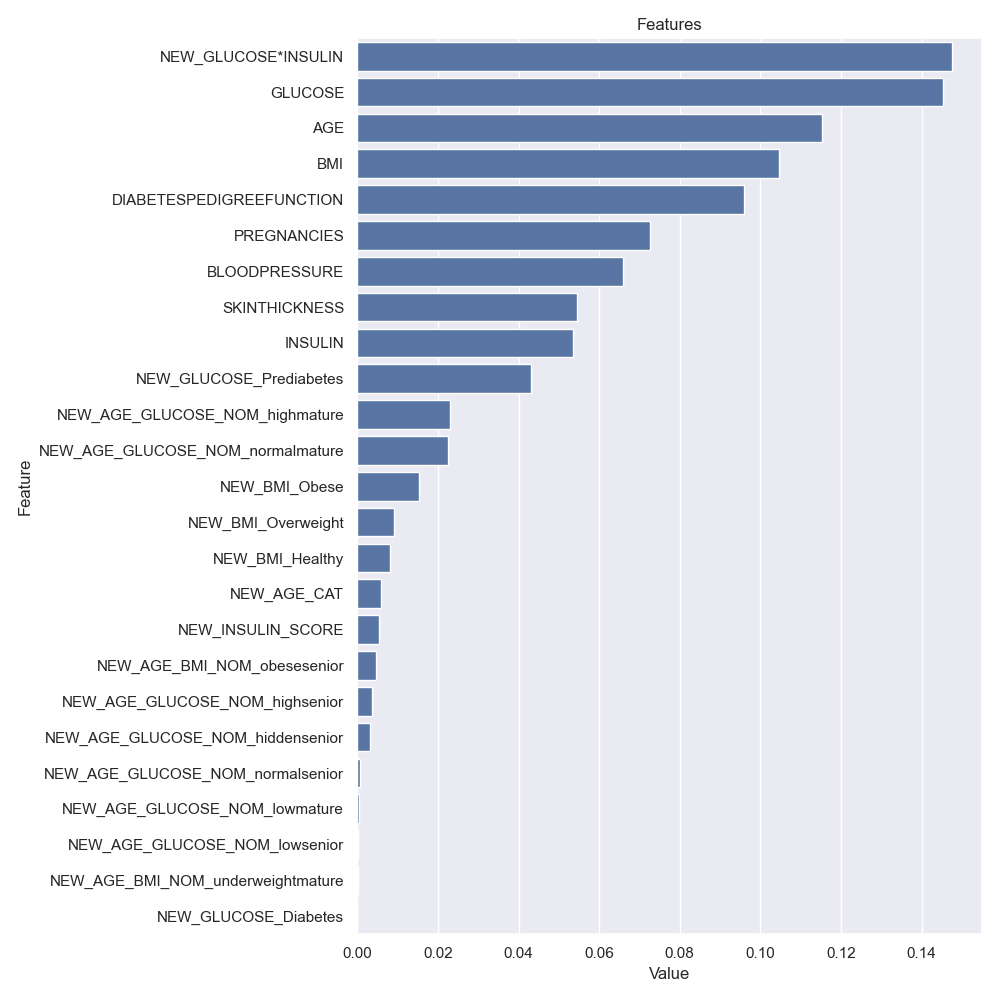

# Diabetes Prediction with Logistic Regression

Problem: With given feature values predict whether the patient has diabetes or not.

***Note: The codes are from the Miuul 'Recommendation Systems' course. Some parts of the codes are modified by me.***

- Clone the 'diabetes randomforest' repository using your terminal or git bash.

```
git clone https://github.com/burcukuleci/diabetes-randomforest.git
```
- Download all required packages using the requirements.txt file by running the below command in the terminal.

```
pip install -r requirements.txt
```

[Dataset](https://www.kaggle.com/datasets/uciml/pima-indians-diabetes-database)

- diabetes.csv 

- 768 observations and 8 numerical independent variables.
- The target variable is indicated as "outcome"
- 1 indicates a positive diabetes test result, and 0 indicates a negative result.

**Variables/Features**

```
Pregnancies: Number of pregnancies
Glucose: Glucose.
BloodPressure: Blood pressure.
SkinThickness: Skin thickness.
Insulin: Insulin.
BMI: Body mass index.
DiabetesPedigreeFunction: A function that calculates our likelihood of diabetes based on our ancestry.
Age: Age (years)
Outcome: Indicates whether the person has diabetes or not. Has the disease (1) or not (0)
```

## 1. Exploratory Data Analysis

- Base Model Metrics (without any data preparation)

```
Accuracy: 0.77
Recall: 0.706
Precision: 0.59
F1: 0.64
Auc: 0.75
```
- base model feature importance



## 2. FEATURE ENGINEERING

- Missing Values

Zero values are changed to NaN. Missing values are imputed with median values of the column. 

```
NaN values 
               n_miss  ratio
Insulin           374 48.700
SkinThickness     227 29.560
BloodPressure      35  4.560
BMI                11  1.430
Glucose             5  0.650
```
- Outliers

Outlilers are changed with upper and lower threshold values that are determined with IQR method. 

- Feature Extraction 

Feature number is increased to 15 from 8.

- Encoding of Categorical Columns
  
*Label Encoding* for two classes, *One-hot Encoding* for more than two classes 

- Standardization

*StandardScaler()* is used. mean=0, standard deviation=1

- **Model Performance after Feature Engineering**

```
Accuracy: 0.79
Recall: 0.711
Precision: 0.67
F1: 0.69
Auc: 0.77
```
**Feature Importance**



## 3. FEATURE IMPORTANCE

In terms of feature importance, 'NEW_GLUCOSE*INSULIN' passed the initial columns and came first.

The process of reducing the number of features by determining the threshold value in terms of feature importance did not contribute to the model success.

```
              before  after
Accuracy:     0.79    0.78
Recall:       0.711   0.688
Precision:    0.67    0.68
F1:           0.69    0.68
Auc:          0.77    0.76
```
